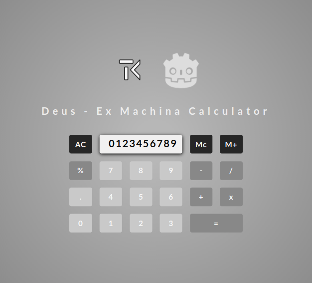
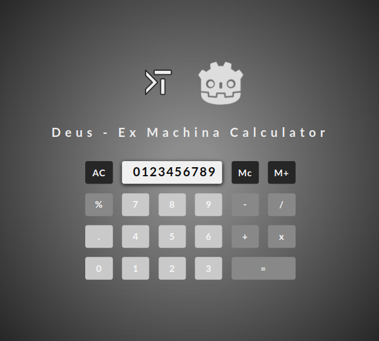

# Calculator Web App - Deus Ex Machina (Practice of the React Framework)

## Description & Functionality
<!-- * In the vertical mode shows the landing page -->
<!-- * In the horizontal mode shows the calculator -->
- File structure by Vite
- Typography(imported, woff2 format) : Lato-bold
- Uses prefered color scheme for dark and light mode defined by user system
- FLEXBOX GRID
<!-- - fully responsive
- button 1 : add + 1
- button 2 : reset
- counter : number of clicks
- animated transitios between old value and new value -->

## Online Link
<!-- [github Pages Link](https://tiborkopca.github.io/Javascript2024-DeusExMachina-SmartphoneCalculator/) -->
<!-- [Vercel](https://javascript2024-deus-ex-machina-smartphone-calculator-rc8ei62ah.vercel.app/) -->

## Screenshots

## Author
[@TiborKopca](https://github.com/TiborKopca)